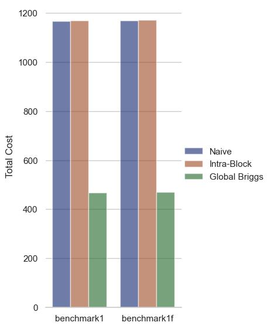
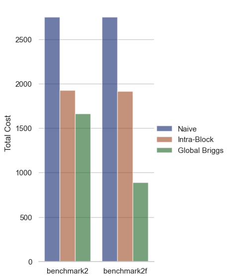
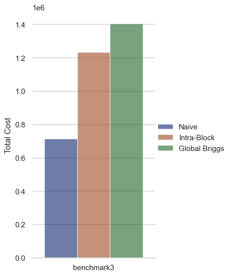

## Comparison of register allocation strategies on three benchmark programs

Below we compare the performance of our register allocation variants on five separate Tiger programs (two having both integer and float variations).

#### Benchmark 1

On the first benchmark program, we see that the Briggs allocator significantly outperforms both Naive allocation and Intra-Block allocation (both reads and writes are cut by > 5x).  This makes sense as the *benchmark1.tiger* executes a simple while loop and operates on local variables with no function calls and the Briggs allocation algorithm has an advantage by keeping all values in registers.  The Intra-Block allocation algorithm performs equally as poorly as the Naive allocator in this scenario.  This also makes sense as the program is short but contains several control flow statements meaning the basic blocks will be small and performance will degrade to the Naive case (with the reads/writes moved around).

Key points:
* Briggs allocator significantly better than both Naive and Intra-Block, cutting total cost by almost 3x
* Naive and Intra-Block performance converge due to small sizes of basic blocks due to the high ratio of branch statements in the program.

#### Benchmark 2

On the second benchmark, we again see the Briggs allocator outperforming both Naive and Intra-Block allocation.  However, we see some disparity in the improvement between the integer and float versions of the program.  We also notice in this benchmark that Intra-Block allocation is now outperforming the Naive allocation.  This is consistent with our expectations as *benchmark2.tiger* is the same as *benchmark1.tiger* with the exception that each arithmetic operation on the variable a is repeateed four times.  Thus the basic blocks have more instructions in them and the advantages of Intra-Block allocation start to manifest.

Key points:
* Briggs allocator still boasts best performance; perfromance edge is higher in the float benchmark
* Intra-Block allocation outperforms Naive allocation thanks to a higher instruction-to-basic-block ratio

#### Benchmark 3

In benchmark 3 we see a reversal of the above patterns where we have the Naive allocator significantly outperforming the Intra-Block allocator which in turn out performs the Briggs allocator.  This program (*benchmark3.tiger*) implements the TAK benchmark algorithm which stresses the call stack mechanism of the compiler by issuing four recursive calls per call.  Our Briggs allocator performs worse primarily due to the fact that it will load allocated variables into registers at the start of a function call as opposed to on demand when they are defined.  This tactic was for simplicity of implementation and may be easily removed (with some testing!).  Thus for each recursive call, the program stores the values of the allocated registers that are live after the call and loads them back after.  The Naive allocator actually avoids this overhead by letting its temp registers get clobbered.  Note that our argument passing occurs entirely on the stack as well, but this applies to each allocator and thus (while a performance point that should be improved) should not affect the relative performance of the allocators.

Key points:
* Briggs performs worse than Naive and Intra-Block (and Intra-Block worse than Naive) in case with many chained recursive function calls
